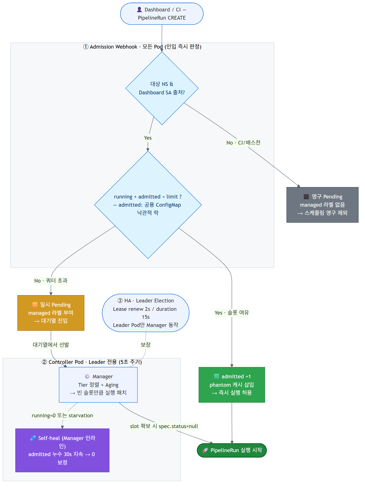
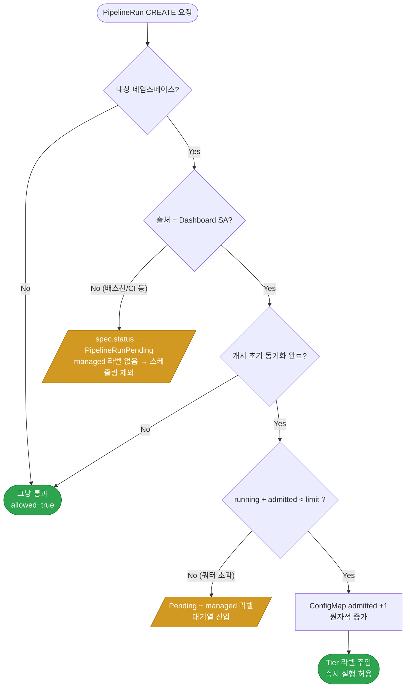
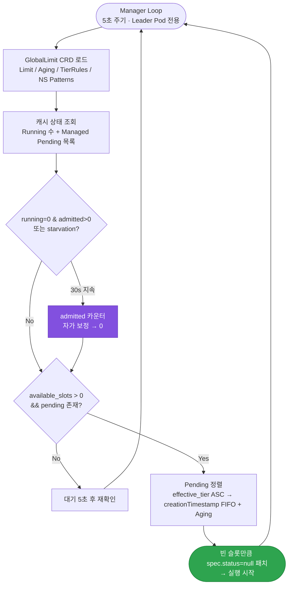
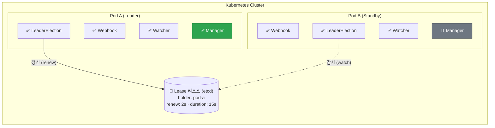
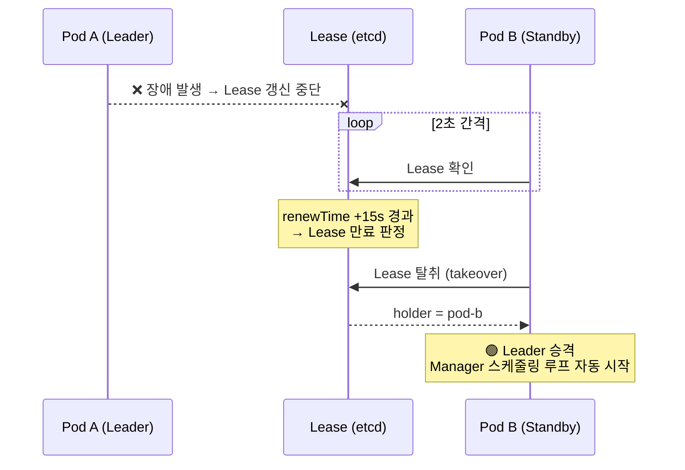
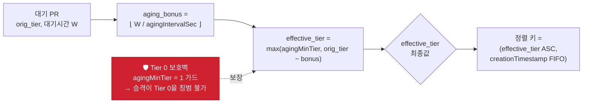
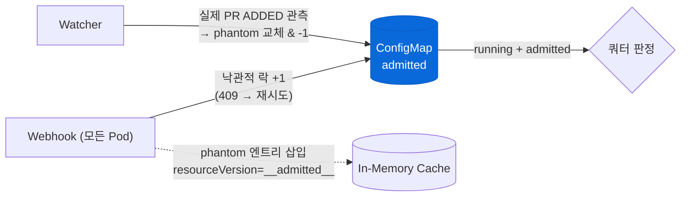

<div align="center">

# 🚦 Tekton Global Queue Controller

**다수의 네임스페이스에 걸친 Tekton PipelineRun의 전역 동시 실행 수를 통제하고, 우선순위 기반으로 스케줄링하는 Kubernetes Admission Webhook 컨트롤러**

[](#13-검증-verification)
[](#13-검증-verification)
[](docker/Dockerfile)
[](#71-사전-요구사항)
[](https://tekton.dev)
[](#6-고가용성-ha-구성)
[](LICENSE)

</div>

---

## ⚡ 한눈에 (TL;DR)

Tekton Pipelines에는 **클러스터 전역 동시 실행 제한이 없어**, 대량 배포가 몰리면 자원 경쟁으로 OOM·노드 장애가 발생합니다. 이 컨트롤러는 API Server 인입 단계(Admission Webhook)에서 이를 선제 통제합니다.

- **외부 락 스토리지 0** — Redis·ZooKeeper 없이 K8s 네이티브 프리미티브(ConfigMap `resourceVersion` 낙관적 락 + Lease)만으로 다중 Pod 간 전역 쿼터 정합성을 확보
- **비파괴적 제어 + 우선순위** — 쿼터 초과 PR을 삭제/재생성 없이 `PipelineRunPending` 주입으로 보류하고, 티어 + 에이징으로 스케줄링해 기아(starvation)를 방지
- **HA + 자가 치유** — Lease 기반 Leader Election으로 ~15초 내 Failover, 카운터 누수는 Manager OR-게이트가 30초 내 자동 보정(결과적 정합성)
- **검증됨** — 158개 단위 테스트 통과 + S1~S4 실클러스터 시나리오에서 동시 실행이 한도를 **단 1건도 초과하지 않음**

> 왜 Go가 아니라 Python인지는 [§3 핵심 설계 결정](#-핵심-설계-결정-key-design-decisions)에서 다룹니다.

---

## 🚀 Quick Start

Kind 로컬 클러스터에 Tekton과 컨트롤러를 배포하고, 버스트 시나리오로 큐 동작을 곧바로 확인할 수 있습니다. (`kind`, `kubectl`, `docker` 필요)

```bash
make kind-setup   # Kind 클러스터 생성 + Tekton + 컨트롤러 자동 배포
make kind-test    # PipelineRun 24개 버스트 생성 → 큐 적체·소진 관찰
```

> 프로덕션 배포(TLS 인증서·HA 구성)는 [§7 설치 및 배포](#7-설치-및-배포)를, 전체 동작 원리는 [§2 워크플로우](#2-워크플로우)를 참고하세요.

---

## 📑 목차

| | 섹션 | | 섹션 |
|---|---|---|---|
| 1 | [개요](#1-개요) | 8 | [설정 참조](#8-설정-참조) |
| 2 | [워크플로우](#2-워크플로우) | 9 | [모니터링 (Prometheus)](#9-모니터링-prometheus) |
| 3 | [아키텍처](#3-아키텍처) | 10 | [Docker 이미지 빌드](#10-docker-이미지-빌드) |
| 4 | [우선순위 스케줄링](#4-우선순위-스케줄링) | 11 | [프로젝트 구조](#11-프로젝트-구조) |
| 5 | [네임스페이스 설정](#5-네임스페이스-설정) | 12 | [admitted 카운터 & 자가 치유](#12-admitted-카운터--자가-치유-self-healing) |
| 6 | [고가용성 (HA)](#6-고가용성-ha-구성) | 13 | [검증 (Verification)](#13-검증-verification) |
| 7 | [설치 및 배포](#7-설치-및-배포) | 14 | [설계 한계 및 향후 과제](#14-설계-한계-및-향후-과제) |

---

## 1. 개요

Tekton Pipelines는 클러스터 전체 단위의 동시 실행 개수를 제한하는 기능을 포함하지 않습니다. 이로 인해 대규모 배포 요청이 동시에 발생하면 자원 경쟁으로 인한 OOM 및 노드 장애가 발생할 수 있습니다.

본 컨트롤러는 **Kubernetes MutatingAdmissionWebhook**을 활용하여 API Server 인입 단계에서 파이프라인 생성 요청을 선제적으로 통제합니다.

| 기능 | 설명 |
|------|------|
| **출처 기반 실행 제어** | Tekton Dashboard에서 생성된 PR만 큐를 통해 실행. 배스천 등 외부 출처는 Pending으로 보류 |
| **전역 동시 실행 제한** | 쿼터 초과 시 `PipelineRunPending` 상태를 즉시 주입하여 자원 고갈 원천 차단 |
| **우선순위 스케줄링** | CRD 기반 티어 분류 + 에이징(Aging) 메커니즘으로 기아(Starvation) 방지 |
| **멀티 네임스페이스** | 복수 패턴 기반 네임스페이스 필터링 (fnmatch 문법) |
| **고가용성 (HA)** | Kubernetes Lease 기반 Leader Election으로 다중 Pod 구성 지원 |
| **API Server 부하 최소화** | SharedInformer 패턴의 로컬 인메모리 캐시 기반 Admission 판정 |
| **모니터링** | Prometheus 메트릭 노출 |

---

## 2. 워크플로우

### 2.0. 전체 흐름 한눈에 보기

PipelineRun 생성부터 실행까지의 전체 경로 — ① Admission Webhook(쿼터 판정) → ② Controller Pod(캐시·스케줄링·자가 치유) → ③ HA(Leader Election)를 한 장으로 정리한 그림입니다. 그림에 등장하는 `admitted` 카운터의 상세 동작과 자가 치유는 [§12](#12-admitted-카운터--자가-치유-self-healing)에서 다룹니다.

<div align="center">
  
</div>

> 📄 편집 가능한 원본: [`docs/images/workflow.mmd`](docs/images/workflow.mmd) · 벡터: [`docs/images/workflow.svg`](docs/images/workflow.svg)

### 2.1. 출처 기반 실행 제어

PipelineRun 생성 시 Webhook이 `request.userInfo.username`을 확인하여 출처를 구분합니다.



- **Dashboard** (`tekton-dashboard` SA): 쿼터 여유 시 즉시 실행, 쿼터 초과 시 대기열 진입
- **그 외 출처**: 항상 `PipelineRunPending` 설정, 매니저가 절대 스케줄링하지 않음

### 2.2. 대기열 스케줄링 흐름



### 2.3. HA (Leader Election) 워크플로우



**Failover 시나리오**



| 역할 | Leader Pod | Standby Pod |
|------|-----------|-------------|
| Webhook `/mutate` | ✅ 처리 | ✅ 처리 (Service 라운드로빈) |
| Watcher 캐시 동기화 | ✅ 실행 | ✅ 실행 (독립적) |
| Manager 스케줄링 | ✅ **실행** | ❌ **대기** |
| Leader Election | ✅ Lease 갱신 | ✅ Lease 감시 |

---

## 3. 아키텍처

| 설계 항목 | 구현 방식 | 기대 효과 |
|-----------|-----------|-----------|
| **출처 구분** | `request.userInfo.username` 기반 Dashboard SA 패턴 매칭 | 배스천/CI 등 외부 생성 PR 자동 보류 |
| **제어 시점** | K8s API Server 인입 시점 (Admission Phase) | 불필요한 이벤트 전파 방지 |
| **초과 쿼터 처리** | JSONPatch를 통한 Pending 상태 + 티어 라벨 주입 | 강제 삭제/재생성 로직 제거 |
| **우선순위 분류** | CRD `tierRules`에 의한 label/env 기반 자동 티어 부여 | 운영 정책 변경 시 코드 수정 불필요 |
| **기아 방지** | 대기 시간 기반 에이징으로 effective tier 자동 승격 | 낮은 우선순위 파이프라인의 무기한 대기 방지 |
| **대기열 정합성** | `creationTimestamp` 기준 정렬 (FIFO) | Pod 재시작 시 순서 보장 |
| **취소/중지 처리** | `Cancelled`, `CancelledRunFinally`, `StoppedRunFinally` 상태 감지 | 취소된 파이프라인의 슬롯 즉시 반환 |
| **Race Condition 방어** | `webhook_admitted_count`로 Webhook-Watcher 간 정합성 유지 | 동시 CREATE 시 쿼터 초과 방지 |
| **고가용성** | Kubernetes Lease 기반 Leader Election | Leader 장애 시 ~15초 내 자동 Failover |

### 💡 핵심 설계 결정 (Key Design Decisions)

외부 의존성을 늘리지 않고 **Kubernetes 네이티브 프리미티브만으로** 분산 정합성·고가용성을 달성한 것이 이 컨트롤러의 핵심 설계입니다.

| 문제 | 선택한 설계 | 대안 대비 이점 |
|------|-------------|----------------|
| 다중 Pod 간 전역 쿼터 정합성 | ConfigMap + `resourceVersion` 낙관적 락 + phantom 엔트리 | Redis 등 외부 분산 락 스토리지 불필요 → 인프라 의존성 0 ([§12](#12-admitted-카운터--자가-치유-self-healing)) |
| 쿼터 초과 PR 처리 | Admission 단계에서 `PipelineRunPending` 주입 | PR 강제 삭제/재생성 없는 비파괴적 제어 |
| 카운터 누수 복구 | Manager 루프 OR-게이트 자가 치유 | 운영자 개입 없이 30초 내 자동 보정 ([§12.2](#122-자가-치유-self-healing)) |
| 고가용성 | K8s Lease 기반 Leader Election | ZooKeeper 등 외부 코디네이터 직접 운영 불필요 |

> **왜 Go(controller-runtime)가 아니라 Python인가?**
> 이 컨트롤러의 정합성·HA 보장은 프레임워크가 아니라 **K8s 네이티브 프리미티브**(ConfigMap `resourceVersion` 낙관적 락, Lease)에 있습니다 — 즉 correctness가 언어에 독립적입니다. 덕분에 controller-runtime의 무게 없이, leader/manager/watcher가 하나의 인메모리 캐시를 공유하는 **단일 경량 프로세스**로 단순하게 유지됩니다. 이 공유 캐시 모델 때문에 멀티프로세스는 정합성을 깨뜨리므로, Gunicorn을 `workers=1` + `threads=8` 스레드 동시성으로 **의도적으로 고정**했습니다([§10.1](#101-dockerfile-구조)).

### 🔒 보안 가드레일

| 계층 | 조치 |
|------|------|
| **전송** | Webhook은 TLS 전용(8443/HTTPS), 자체 서명 인증서 + `caBundle` 검증 |
| **실행** | 컨테이너 non-root 실행(uid 1001), `python:3.11-slim` 최소 베이스 |
| **네트워크** | `install/networkpolicy.yaml`로 ingress/egress 제한 |
| **권한** | 컨트롤러 SA는 필요한 리소스에 대한 최소 RBAC만 보유 (상세: [`docs/security.md`](docs/security.md)) |

---

## 4. 우선순위 스케줄링

### 4.1. 티어 분류 체계

GlobalLimit CRD의 `tierRules`를 통해 PipelineRun의 우선순위를 자동 분류합니다. 규칙은 순서대로 매칭되며, 먼저 매칭된 규칙이 적용됩니다.

| 매칭 순서 | matchType | 매칭 대상 | 예시 | Tier |
|-----------|-----------|-----------|------|------|
| 1순위 | `label` | `metadata.labels`의 지정 키 | `queue.tekton.dev/urgent: "true"` | 0 (긴급) |
| 2순위 | `env` | `metadata.labels.env` | `prod` | 1 (운영) |
| 3순위 | `env` | `metadata.labels.env` | `stg` | 2 (검증) |
| 기본값 | `env` | `metadata.labels.env` | `*` (나머지) | 3 (개발) |

### 4.2. 에이징 (Aging) 메커니즘

대기열에서 장시간 대기하는 파이프라인의 effective tier를 자동으로 승격시켜 기아 현상을 방지합니다.

- **승격 주기:** `agingIntervalSec` (기본 180초)마다 effective tier가 1 감소
- **승격 하한:** `agingMinTier` (기본 1) 이하로는 내려가지 않음
- **Tier 0 보호:** 에이징으로 Tier 0(긴급)에 도달할 수 없으므로, 수동 긴급 배포의 최우선 지위가 항상 보장됨



**예시** (`agingIntervalSec=180`, `agingMinTier=1`): Tier 3 PR이 9분(540초) 대기하면 `bonus=3` → `effective_tier = max(1, 3−3) = 1` 로 승격되어 운영(Tier 1)과 동등하게 경쟁하지만, **Tier 0(긴급)은 절대 넘볼 수 없습니다.**

### 4.3. 긴급 배포

PipelineRun 생성 시 아래 라벨을 추가하면 Tier 0으로 분류됩니다.

```yaml
metadata:
  labels:
    queue.tekton.dev/urgent: "true"
```

---

## 5. 네임스페이스 설정

GlobalLimit CRD의 `spec.namespacePatterns`에서 설정합니다. `fnmatch` 문법(`*`, `?`, `[seq]`)을 지원하며, 재배포 없이 런타임에 변경 가능합니다.

```yaml
apiVersion: tekton.devops/v1
kind: GlobalLimit
metadata:
  name: tekton-queue-limit
spec:
  namespacePatterns:
    - "*-cicd"
    - "production-*"
  maxPipelines: 10
```

```bash
kubectl patch globallimit tekton-queue-limit --type=merge \
  -p '{"spec":{"namespacePatterns":["*-cicd","newapp-*"]}}'
```

| 패턴 | 매칭 | 불일치 |
|------|------|--------|
| `*-cicd` | `myapp-cicd`, `test-cicd` | `myapp-deploy` |
| `tekton-*` | `tekton-pipelines` | `my-tekton` |
| `prod-*` | `prod-api`, `prod-web` | `staging-api` |

---

## 6. 고가용성 (HA) 구성

Kubernetes Lease 기반 Leader Election으로 **다중 Pod(replicas ≥ 2)** 구성을 지원합니다.

| 파라미터 | 값 | 설명 |
|---------|-----|------|
| Lease Duration | 15초 | Lease 유효 기간 |
| Retry Period | 2초 | Lease 체크/갱신 주기 |
| 장애 복구 시간 | ~15초 | Leader 장애 시 Standby 승격까지 최대 시간 |

```bash
kubectl exec -n tekton-pipelines <pod-name> -- curl -sk https://localhost:8443/healthz
# {"leader": true, "pod": "tekton-queue-controller-xxx", "status": "ok"}
```

```yaml
spec:
  replicas: 2  # HA 기본 구성 (2~3 권장)
```

---

## 7. 설치 및 배포

### 7.1. 사전 요구사항

- Kubernetes Cluster (v1.20+)
- Tekton Pipelines 설치 완료
- OpenSSL (웹훅용 TLS 인증서 생성)

### 7.2. TLS 인증서 및 Secret 생성

```bash
cat > csr.conf <<EOF
[req]
req_extensions = v3_req
distinguished_name = req_distinguished_name
[req_distinguished_name]
[ v3_req ]
basicConstraints = CA:FALSE
keyUsage = nonRepudiation, digitalSignature, keyEncipherment
extendedKeyUsage = serverAuth
subjectAltName = @alt_names
[alt_names]
DNS.1 = tekton-queue-controller
DNS.2 = tekton-queue-controller.tekton-pipelines
DNS.3 = tekton-queue-controller.tekton-pipelines.svc
EOF

openssl genrsa -out tls.key 2048
openssl req -new -key tls.key -out tls.csr \
  -subj "/CN=tekton-queue-controller.tekton-pipelines.svc" \
  -config csr.conf
openssl x509 -req -in tls.csr -signkey tls.key -out tls.crt \
  -days 3650 -extensions v3_req -extfile csr.conf

kubectl create secret tls tekton-queue-cacerts \
  --cert=tls.crt --key=tls.key -n tekton-pipelines
```

### 7.3. 배포 순서

```bash
# 1. CRD 등록
kubectl apply -f install/crd.yaml

# 2. GlobalLimit 설정
kubectl apply -f install/limit-setting.yaml

# 3. Controller 배포
#    ⚠️ deploy.yaml의 caBundle을 실제 값으로 교체하세요:
#    cat tls.crt | base64 | tr -d '\n'
kubectl apply -f install/deploy.yaml
```

### 7.4. 배포 확인

```bash
kubectl get pods -n tekton-pipelines -l app=tekton-queue
kubectl get globallimits
kubectl exec -n tekton-pipelines <pod-name> -- curl -sk https://localhost:8443/healthz
```

---

## 8. 설정 참조

### 8.1. GlobalLimit CRD 필드

| 필드 | 타입 | 필수 | 기본값 | 설명 |
|------|------|------|--------|------|
| `spec.namespacePatterns` | `string[]` | ❌ | `["*-cicd"]` | 관리 대상 네임스페이스 패턴 목록 |
| `spec.maxPipelines` | `integer` | ✅ | - | 동시 실행 가능한 최대 파이프라인 수 |
| `spec.agingIntervalSec` | `integer` | ❌ | 180 | 에이징 승격 주기 (초) |
| `spec.agingMinTier` | `integer` | ❌ | 1 | 에이징으로 도달 가능한 최소 Tier |
| `spec.tierRules` | `object[]` | ❌ | 기본 규칙 | 티어 분류 규칙 배열 |
| `spec.managedSAPatterns` | `string[]` | ❌ | env var 또는 `["system:serviceaccount:tekton-pipelines:tekton-dashboard"]` | 큐가 관리하는 SA 패턴 목록 (fnmatch 문법) |

### 8.2. 환경변수

| 환경변수 | 기본값 | 설명 |
|---------|--------|------|
| `POD_NAME` | `controller-{PID}` | Pod 이름 (Leader Election용, Downward API로 주입) |
| `POD_NAMESPACE` | `tekton-pipelines` | Pod 네임스페이스 (Lease 생성 위치) |
| `LEASE_NAME` | `tekton-queue-controller-leader` | Leader Election Lease 리소스 이름 |
| `MANAGED_SA_PATTERNS` | `system:serviceaccount:tekton-pipelines:tekton-dashboard` | 큐가 관리하는 SA 패턴 (기본값 단일 패턴, CRD에서 배열로 확장 가능) |

### 8.3. 엔드포인트

| 경로 | 포트 | 설명 |
|------|------|------|
| `/mutate` | 8443 (HTTPS) | Admission Webhook 엔드포인트 |
| `/healthz` | 8443 (HTTPS) | Liveness Probe (leader 상태 포함) |
| `/readyz` | 8443 (HTTPS) | Readiness Probe (초기 동기화 상태) |
| `/metrics` | 9090 (HTTP) | Prometheus 메트릭 |

---

## 9. 모니터링 (Prometheus)

| 메트릭 | 타입 | 라벨 | 설명 |
|--------|------|------|------|
| `tekton_queue_limit` | Gauge | - | 글로벌 동시 실행 허용량 |
| `tekton_queue_running_total` | Gauge | - | 현재 실행 중인 파이프라인 수 |
| `tekton_queue_pending_total` | Gauge | `tier` | 대기열 파이프라인 수 (Tier별) |
| `tekton_queue_webhook_admitted_total` | Counter | `tier` | Dashboard PR 즉시 실행 허용 횟수 |
| `tekton_queue_webhook_queued_total` | Counter | `tier` | Dashboard PR 쿼터 초과 대기열 진입 횟수 |
| `tekton_queue_webhook_held_total` | Counter | `tier` | Dashboard 외 출처 PR 보류 횟수 |
| `tekton_queue_scheduled_total` | Counter | `tier` | Manager 스케줄링 횟수 |
| `tekton_queue_kubernetes_api_errors_total` | Counter | `operation` | K8s API 에러 횟수 |

```yaml
scrape_configs:
  - job_name: tekton-queue-controller
    static_configs:
      - targets:
        - tekton-queue-controller.tekton-pipelines.svc.cluster.local:9090
```

---

## 10. Docker 이미지 빌드

### 10.1. Dockerfile 구조

이미지는 `docker/Dockerfile`에 정의되어 있으며, **Python 3.11-slim** 기반으로 빌드됩니다. WSGI 서버로 **Gunicorn**을 사용합니다.

```
python:3.11-slim (Base)
  └─ /app
       ├── requirements.txt    ← pip 의존성 설치
       ├── src/                 ← 비즈니스 로직 모듈
       └── gunicorn.conf.py     ← Gunicorn 설정 (진입점: post_fork에서 스레드 기동)
```

| 레이어 | 설명 |
|--------|------|
| `COPY requirements.txt` → `pip install` | 의존성만 먼저 설치하여 Docker 캐시 최적화 |
| `COPY src/`, `COPY gunicorn.conf.py` | 소스 코드 및 서버 설정 복사 |
| `useradd -u 1001 appuser` | 보안을 위한 비루트 사용자 실행 |
| `EXPOSE 8443 / 9090` | Webhook(HTTPS) 및 Prometheus 메트릭 포트 |
| `CMD gunicorn -c gunicorn.conf.py src.webhook:app` | Gunicorn으로 Flask 앱 구동 |

**Gunicorn 설정 (`docker/gunicorn.conf.py`):**

| 항목 | 값 | 이유 |
|------|-----|------|
| `workers` | 1 | leader/manager/watcher 스레드가 in-memory 캐시를 공유하므로 멀티 프로세스 불가 |
| `worker_class` | gthread | 스레드 기반 동시 요청 처리 (Flask `threaded=True`와 동일한 모델) |
| `threads` | 8 | 동시 Webhook 요청 처리 |
| `timeout` | 120 | K8s Webhook 타임아웃(최대 30초)보다 길게 설정하여 worker 불필요 재시작 방지 |

### 10.2. 이미지 빌드 (수동)

프로젝트 루트 디렉터리에서 실행합니다.

```bash
# 기본 빌드
docker build -t tekton-queue-controller:local -f docker/Dockerfile .
```

빌드가 완료되면 이미지를 확인합니다.

```bash
docker images | grep tekton-queue-controller
# tekton-queue-controller   local   abc123def456   10 seconds ago   185MB
```

<details>
<summary><b>10.3. 이미지 태깅 &amp; 레지스트리 Push</b> (표준 Docker 절차 — 펼치기)</summary>

```bash
# 버전 / 레지스트리 태그 지정
docker tag tekton-queue-controller:local <REGISTRY_HOST>/tekton-queue-controller:v1.0.0

# 로그인 후 푸시
docker login <REGISTRY_HOST>
docker push <REGISTRY_HOST>/tekton-queue-controller:v1.0.0
```

> **참고:** `install/deploy.yaml`의 `spec.containers[].image` 값을 푸시한 이미지 경로로 변경해야 합니다.

</details>

### 10.4. Kind 로컬 클러스터에 로드

프라이빗 레지스트리 없이 로컬 Kind 클러스터에서 테스트하려면 이미지를 직접 로드합니다.

```bash
# Kind 클러스터에 이미지 로드
kind load docker-image tekton-queue-controller:local --name tekton-test
```

### 10.5. Makefile 단축 명령

위 과정을 Makefile로 간편하게 실행할 수 있습니다.

```bash
make build       # Docker 이미지 빌드
make load        # 빌드 + Kind 클러스터 로드
make deploy      # K8s 리소스 배포 (install/ 디렉터리)
make all         # 빌드 + 로드 + 배포 (전체 워크플로우)
make kind-setup  # Kind 클러스터 생성 + Tekton + 컨트롤러 자동 배포
make kind-test   # Kind 클러스터에서 S3 Burst 재현 (24개 PipelineRun)
make test        # pytest 단위 테스트
make simulate    # S1~S4 스케줄링 시뮬레이션 (K8s 불필요)
make lint        # flake8 코드 검사
make clean       # 이미지 삭제
```

Makefile 변수를 오버라이드하여 이미지 이름과 태그를 변경할 수 있습니다.

```bash
# 커스텀 이미지 이름/태그로 빌드
make build IMAGE_NAME=harbor.example.com/devops/tekton-queue-controller IMAGE_TAG=v1.0.0

# 다른 Kind 클러스터에 로드
make load CLUSTER_NAME=my-cluster
```

---

## 11. 프로젝트 구조

```
tekton_queue_controller/
├── Makefile                # 빌드 및 배포, 자동화 명령어
├── docker/
│   ├── Dockerfile          # 컨테이너 이미지 빌드 스크립트 (Python 3.11+)
│   ├── gunicorn.conf.py    # Gunicorn 프로덕션 서버 설정 (진입점)
│   └── requirements.txt    # Python 의존성 (Flask, Gunicorn, Kubernetes 등)
├── src/                    # 비즈니스 로직(Backend 모듈)
│   ├── __init__.py
│   ├── state.py            # Global 공유 상태 자원
│   ├── config.py           # CRD 설정 로드 및 환경변수
│   ├── cache.py            # 인메모리 PR 캐시 및 Admitted 카운터 제어
│   ├── metrics.py          # Prometheus 메트릭 정의
│   ├── webhook.py          # Flask 기반 Mutating Webhook API
│   └── workers/            # 백그라운드 Worker 스레드
│       ├── __init__.py
│       ├── leader.py       # Kubernetes Lease 기반 리더 선출
│       ├── manager.py      # 티어 기반 대기열 평가 및 스케줄링
│       └── watcher.py      # PipelineRun Informer/Watcher 동기화
├── docs/                   # 아키텍처 및 SRE 운영 문서
│   ├── architecture.md     # 시스템 아키텍처 및 상세 컴포넌트 구조
│   ├── security.md         # 네트워크 정책 및 권한 가이드
│   ├── runbook.md          # 롤백 및 장애 대응 매뉴얼
│   └── images/             # 다이어그램 (workflow.mmd/svg/png)
├── install/                # K8s 매니페스트
│   ├── crd.yaml
│   ├── deploy.yaml
│   ├── limit-setting.yaml
│   ├── networkpolicy.yaml
│   └── secret.yaml
└── grafana-dashboard/
    └── grafana-dashboard.json
```

---

## 12. admitted 카운터 & 자가 치유 (Self-healing)

### 12.1. 왜 필요한가

Webhook은 **모든 Pod에서** 동작하므로(Service 라운드로빈), 동시에 들어온 CREATE 요청들이 각자 캐시만 보고 판정하면 쿼터를 초과할 수 있습니다. 이를 막기 위해 **클러스터 공용 ConfigMap(`tekton-queue-admitted-count`)** 에 "Webhook이 통과시켰지만 아직 Watcher 캐시에 running으로 반영되기 전" 인플라이트 수를 기록합니다.



| 단계 | 동작 |
|------|------|
| **증가** | Webhook 통과 시 ConfigMap `admitted` 를 낙관적 락(409 Conflict 재시도)으로 원자적 +1 |
| **Phantom** | 실명 PR은 캐시에 `resourceVersion: __admitted__` 임시 엔트리 삽입 → Watcher 이벤트 도착 전까지 running으로 집계 |
| **감소** | Watcher가 실제 PR ADDED를 관측하면 phantom을 교체하고 `admitted` -1 |
| **Fallback** | ConfigMap API 장애 시 per-pod 로컬 카운터로 graceful degradation |

### 12.2. 자가 치유 (Self-healing)

ConfigMap 감산이 **5회 재시도 모두 실패**(API 순단·경합)하면 공용 카운터가 실제보다 높게 **누수(leak)** 될 수 있습니다. Watcher 전체 재동기화(410 Gone)는 한가한 클러스터에서 드물게 발생하므로, Manager 루프가 두 가지 누수 징후를 **OR**로 감지해 30초 이상 지속될 때 카운터를 0으로 자동 보정합니다.

| 게이트 | 조건 | 잡는 상황 |
|--------|------|-----------|
| **idle 선제 청소** | `running == 0` 이고 `admitted > 0` | 모두 종료됐는데 카운터만 남음 → 다음 신규 요청의 "유령 대기" 방지 |
| **starvation 구제** | `pending` 존재 & `available_slots ≤ 0` & `admitted > 0` | 부분 누수가 누적되어 실행 중 PR이 있어도 스케줄링이 막힌 경우 |

> 30초 임계값은 통상 in-flight 머티리얼라이제이션 시간(~2초)보다 충분히 길어, 정상 동작을 오탐하지 않습니다. (K8s Admission Webhook 최대 타임아웃과도 정합)

---

## 13. 검증 (Verification)

### 13.1. 로컬 개발 & 단위 테스트

클러스터 없이 소스에서 바로 테스트를 재현할 수 있습니다.

```bash
python -m venv .venv && source .venv/bin/activate   # Windows: .venv\Scripts\activate
pip install -r docker/requirements.txt pytest flake8

make test        # = python -m pytest tests/ -v
make lint        # = flake8 src/ tests/ --max-line-length=120
make simulate    # S1~S4 스케줄링 로직 시뮬레이션 (K8s 불필요)
```

**158 passed** — Webhook 동시성·Leader Election·Watcher 재동기화·Tier 분류·self-healing OR-게이트 등 포함.

### 13.2. 통합 테스트 (실 클러스터, S1~S4)

`docker-desktop` Kubernetes에 Tekton + 컨트롤러를 실제 배포하여 4개 시나리오를 검증했습니다. **모든 시나리오에서 동시 실행 수가 `maxPipelines` 한도를 단 1건도 초과하지 않았습니다.**

| 시나리오 | 설명 | 완료 | 최대 동시 (peak / L_max) | 결과 |
|----------|------|------|--------------------------|------|
| **S1** Baseline | 정상 부하, Tier 1:2:3 = 1:2:7 | 10/10 | 5 / 5 | ✅ 슬롯 한도 준수 |
| **S2** Priority | Tier3×5 선점 후 Tier1×3 진입 | 8/8 | 3 / 3 | ✅ 큐 우선순위 정렬(비선점) |
| **S3** Burst | L_max×3 동시 생성 (15개) | 15/15 | 5 / 5 | ✅ 버스트 흡수 |
| **S4** Adversarial | λ(0.25/s) > μ(0.15/s) 포화 | 12/12 | 3 / 3 | ✅ 적체 후 완전 소진 |

> **S2 우선순위 참고:** 컨트롤러는 비선점형이므로 t=0에 빈 슬롯을 먼저 점유한 Tier3는 끝까지 실행됩니다. 우선순위는 **대기열에서 경쟁한 건**에만 적용되며, 실측 결과 대기 24s의 Tier1이 대기 63~74s의 Tier3보다 먼저 스케줄되어 정책이 정확히 동작함을 확인했습니다.

```bash
# 통합 시나리오 재현 (기본 컨텍스트: docker-desktop, KUBE_CONTEXT로 변경 가능)
python -m tests.integration_scenarios
```

---

## 14. 설계 한계 및 향후 과제

- **비선점형 설계:** 실행 중인 낮은 티어 파이프라인의 선점은 지원하지 않습니다. 우선순위 정렬은 대기열 진입 이후 Manager에서만 적용됩니다.
- **admitted 카운터 정합성:** Webhook 통과 후 PR 생성 실패 등으로 카운터가 일시적으로 높게 유지될 수 있으나, [§12.2 자가 치유](#122-자가-치유-self-healing)가 누수를 30초 내 자동 보정하며 Watcher 전체 재동기화 시에도 리셋됩니다.
- **CRD 변경 반영 지연:** GlobalLimit CRD 변경 시 최대 5초의 반영 지연이 있습니다.
- **HA Failover 지연:** Leader 장애 시 최대 ~15초의 스케줄링 공백이 발생합니다. 이 동안 Webhook은 모든 Pod에서 정상 처리됩니다.
- **관리 SA 패턴 변경 시 재배포 필요:** `MANAGED_SA_PATTERNS` 환경변수 변경은 Pod 재시작이 필요합니다. SA 패턴 추가는 `spec.managedSAPatterns` 배열에 항목을 추가하면 재배포 없이 반영됩니다.
- **self-healing 임계값 고정:** `ADMITTED_LEAK_HEAL_SEC`(30초)는 현재 상수입니다. 향후 CRD 노출을 검토할 수 있습니다.
- **self-healing 관측성:** 자가 치유 발동은 현재 **로그로만** 기록됩니다. SRE 알람 연동을 위한 전용 Prometheus 카운터(예: `tekton_queue_self_healing_total`) 노출은 향후 과제입니다.

---

## 라이선스

[MIT](LICENSE) © 2026 Wongjun Jang
