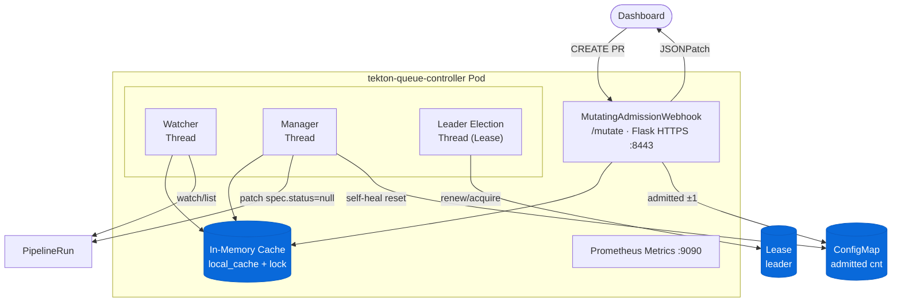
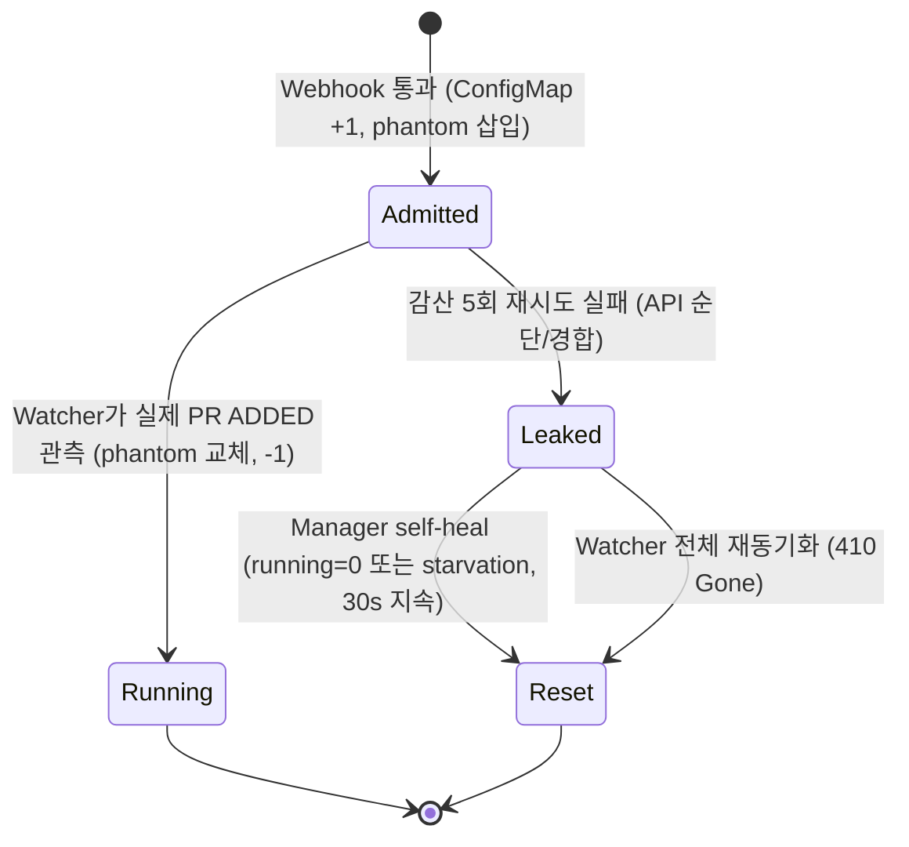

# Tekton Queue Controller — Architecture

## 1. 개요

Tekton Queue Controller는 Kubernetes MutatingAdmissionWebhook + 백그라운드 스케줄러로 구성된 컨트롤러입니다.  
Dashboard를 통해 생성되는 PipelineRun의 동시 실행 수를 제한하고, 우선순위(Tier) 기반으로 대기열을 관리합니다.

---

## 2. 컴포넌트 다이어그램



---

## 3. Webhook 처리 흐름

```
PipelineRun CREATE 요청
        │
        ▼
대상 네임스페이스인가? ──No──▶ 그냥 통과 (allowed=True)
        │ Yes
        ▼
Dashboard SA 출처인가? ──No──▶ Pending 설정 (managed 라벨 없음, 스케줄링 제외)
        │ Yes
        ▼
캐시 초기 동기화 완료? ──No──▶ 그냥 통과 (캐시 미준비 방어)
        │ Yes
        ▼
쿼터(running + admitted) < limit? ──No──▶ Pending + managed 라벨 추가 (대기열)
        │ Yes
        ▼
ConfigMap admitted+1 (원자적)
        │
        ▼
Tier 라벨 추가 → 즉시 실행 허용
```

---

## 4. Tier (우선순위) 결정 로직

| Tier | 조건 | 설명 |
|------|------|------|
| 0 | `queue.tekton.dev/urgent: "true"` 라벨 | 긴급 배포 |
| 1 | `env` 라벨이 `prod` 패턴 매칭 | 운영 배포 |
| 2 | `env` 라벨이 `stg` 패턴 매칭 | 검증 배포 |
| 3 | 그 외 (기본값) | 개발 |

**Aging**: 대기 시간이 `aging_interval_sec` 초마다 Tier 1씩 승격 (최소 `aging_min_tier`까지).

---

## 5. Leader Election (HA)

- K8s `coordination.k8s.io/v1` Lease 리소스를 사용
- Lease 이름: `tekton-queue-controller-leader` (기본값)
- `LEASE_DURATION_SEC=15`, `LEASE_RETRY_PERIOD_SEC=2`
- **리더만** Manager 루프(스케줄링)를 실행함
- 리더 **탈취(takeover)** 시 `_reset_global_admitted()` 호출로 ConfigMap 카운터 초기화
- 갱신 충돌(409)·탈취 충돌 발생 시 즉시 `is_leader=False` 로 내려 **이중 리더(dual-leader)** 구간을 제거

---

## 5-1. admitted 카운터 & 자가 치유 (Self-healing)

Webhook은 모든 Pod에서 동작하므로, cross-pod 쿼터 정합성을 위해 공용 ConfigMap `tekton-queue-admitted-count` 에 인플라이트 수를 기록한다.



| 메커니즘 | 트리거 | 효과 |
|----------|--------|------|
| 낙관적 락 증가/감소 | Webhook 통과 / Watcher ADDED | 409 Conflict 재시도로 원자성 보장 |
| per-pod fallback | ConfigMap API 장애 | 로컬 카운터로 graceful degradation |
| **self-heal (OR 게이트)** | `running==0 & admitted>0` **또는** `pending & slots≤0 & admitted>0` 가 30s 지속 | `_reset_global_admitted()` 로 누수 자동 보정 (`src/workers/manager.py`) |
| 전체 재동기화 리셋 | Watcher 410 Gone | 캐시 재구축 + 카운터 0 |

---

## 6. 모듈 의존 관계

```
config.py ◀─── metrics.py
    │
    ├──────▶ cache.py ◀─── state.py
    │            │
    │            ▼
    └──────▶ webhook.py
                 │
        workers/*.py ◀── state.py
```

| 모듈 | 의존 |
|------|------|
| `config.py` | `kubernetes` 클라이언트, 환경 변수 |
| `metrics.py` | `prometheus_client` |
| `state.py` | `threading` |
| `cache.py` | `config.py`, `metrics.py`, `state.py` |
| `webhook.py` | `flask`, `cache.py`, `config.py`, `metrics.py`, `state.py` |
| `workers/leader.py` | `config.py`, `metrics.py`, `state.py`, `cache.py` |
| `workers/manager.py` | `config.py`, `metrics.py`, `cache.py`, `state.py` |
| `workers/watcher.py` | `config.py`, `metrics.py`, `cache.py`, `state.py` |

---

## 7. 포트 및 엔드포인트

| 포트 | 프로토콜 | 용도 |
|------|----------|------|
| 8443 | HTTPS | Webhook `/mutate`, `/healthz`, `/readyz` |
| 9090 | HTTP | Prometheus `/metrics` |

---

## 8. Prometheus 메트릭 목록

| 메트릭 | 종류 | 설명 |
|--------|------|------|
| `tekton_queue_limit` | Gauge | 설정된 최대 동시 실행 수 |
| `tekton_queue_running_total` | Gauge | 현재 실행 중인 수 |
| `tekton_queue_pending_total` | Gauge | Tier별 대기 중인 수 |
| `tekton_queue_webhook_admitted_total` | Counter | Webhook에서 즉시 허용된 수 |
| `tekton_queue_webhook_queued_total` | Counter | 쿼터 초과로 대기열 이동된 수 |
| `tekton_queue_webhook_held_total` | Counter | Dashboard 외 출처로 보류된 수 |
| `tekton_queue_scheduled_total` | Counter | Manager가 스케줄링한 수 |
| `tekton_queue_kubernetes_api_errors_total` | Counter | K8s API 에러 횟수 |
